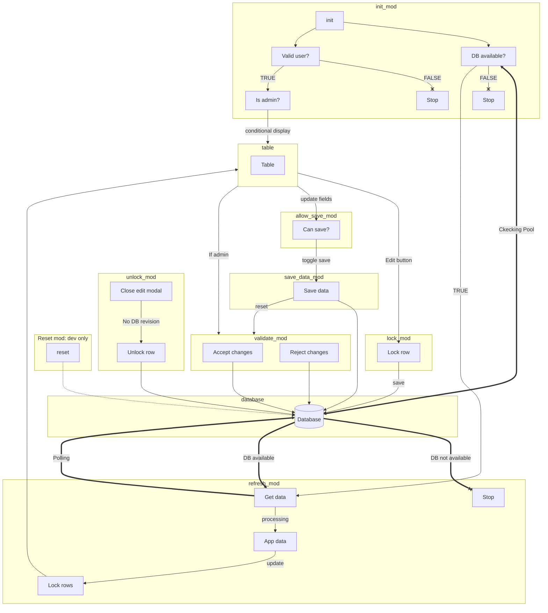

<!-- README.md is generated from README.Rmd. Please edit that file -->

```{r, include = FALSE}
knitr::opts_chunk$set(
  collapse = TRUE,
  comment = "#>",
  fig.path = "man/figures/README-",
  out.width = "100%"
)
```

# tableEditor

<!-- badges: start -->
[](https://lifecycle.r-lib.org/articles/stages.html#experimental)

<!-- badges: end -->

The goal of tableEditor is to provide an interactive data editor.

## Notes

The app is still very much experimental and performances are not optimal.

## Installation

You can install the development version of tableEditor from [GitHub](https://github.com/) with:

``` r
# install.packages("devtools")
devtools::install_github("DivadNojnarg/shiny-edit-data")
```

## Example

This package allows to deploy a data editor in few steps.

1. Create a config file `config.yml`:

  - `production`: if FALSE, you are allowed to reset the data by clicking on the reset
  button (invisible in production). The default data are defined in `data_reset`.
  - `version`: Metadata displayed in the footer.
  - `db_name`, `db_user`: Database name and user. They are not secrets. Password and host are
  stored in environment variables, be careful not to expose them.
  - `db_data_name`: Table which contains data to edit. Note: a metadata table is also created
  - `db_admins_name`: A table containing admin data. Mandatory.
  - `filter_cols`: Leave empty to select all columns. All passed columns will be saved in the database.
  - `edit_cols`: Must be a subset of `filter_cols` if the latter is not empty. These columns are editable.
  - `hidden_cols`: There might be columns in `filter_cols` that need to be
  in the database but not shown in the table. Must be a subset of `filter_cols` if the latter is not empty.
  Will error if any of `hidden_cols` is found in `edit_cols`.
  - `col_defs`: Pass custom reactable `colDef` options. Expect a named list (see package examples). `col_defs` names must not belong to `hidden_cols` and has to be a subset of `filter_cols` or the data of edit if `filter_cols` is empty.
  - `status_ok`, `status_review`, ...: The app assumes 4 data states. First, data are in `OK` state, which means they are unchanged. As soon as someone modifies the data, they become `IN REVIEW`. The app supports an admin mode, where one can validate or invalidate the changes resulting in 2 other data states, respectively `ACCEPTED` and `REJECTED`. Once validated any further change will reset the validation state such that data are `IN REVIEW`.
  - `data_reset`: dataset used to reset data. Only in development mode when `production` is FALSE.

```yaml
# Below are the supported default items.
production: false
version: 0.1.0
db_name: "DB_NAME"
db_user: "DB_USER"
db_data_name: "DATA_TABLE_NAME"
db_admins_name: "ADMINS_TABLE_NAME"
admin_type_col: "type"
admin_user_col: "user"
filter_cols: !expr c()
edit_cols: !expr c()
hidden_cols: !expr c()
col_defs: !expr list()
status_ok: "OK"
status_review: "IN REVIEW"
status_accepted: "ACCEPTED"
status_rejected: "REJECTED"
data_reset: !expr datasets::iris
```

2. Create the tables. We need 2 tables: one for admin check and one for the main
data to edit. The admin check is based on the `admin_type_col` and `admin_user_col `config values.
Be careful to pass correct column names in the admin table. Below, the corresponding column is `type` (if you change it, 
don't forget to update the config). We also create an example table with iris data.

```r
library(DBI)

con <- dbConnect(
  RPostgres::Postgres(),
  dbname = 'DB_NAME', 
  host = 'HOST', # i.e. 'ec2-54-83-201-96.compute-1.amazonaws.com'
  port = PORT, # or any other port specified by your DBA
  user = 'USER',
  password = 'PSWD'
)

# Admin data
admin_dat <- dplyr::tribble(
  ~user, ~type, ~name, ~department, ~position,
  "johndo1", "user", "John Doe", "IT", "Data Scientist",
  "admin1", "admin", "Admin", "IT", "Leader"
)

dbWriteTable(con, "admins", admin_dat)

# Create dummy table with iris data + an extra metadata table containing
# the columnes types in order to be able to restore factors (in SQL, factors are lost).
prepare_data(con, iris, overwrite = TRUE)
```

3. Create an `app.R` script starting by the configuration linking.

```{r eval=FALSE}
options("yaml.eval.expr" = TRUE, "app.config.path" = "<PATH_TO_CONFIG>")

tableEditor::run()
```

4. Deploy to a server and enjoy. Don't forget to setup the environment variables
to connect to the database!

## App flow

How this app works (WIP):


